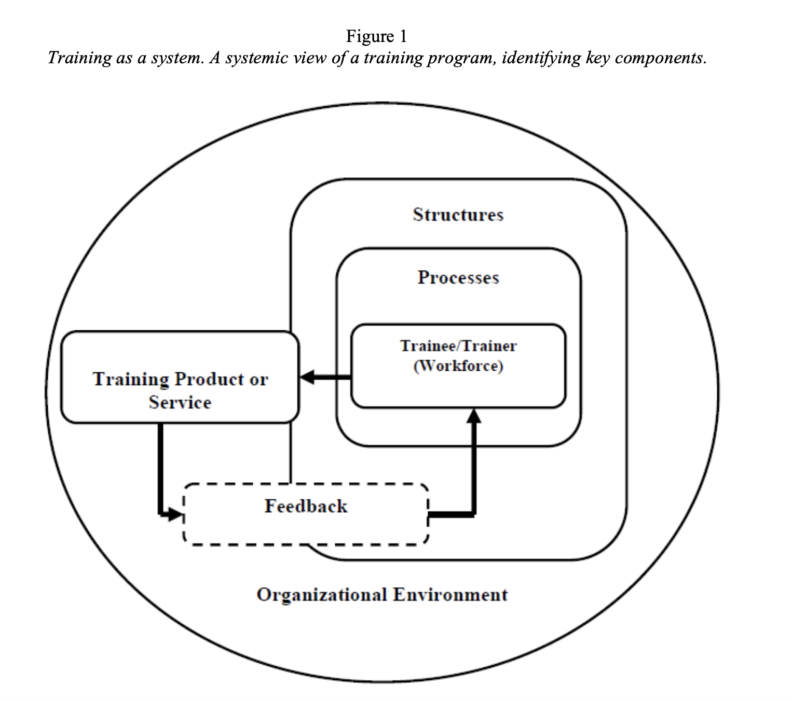
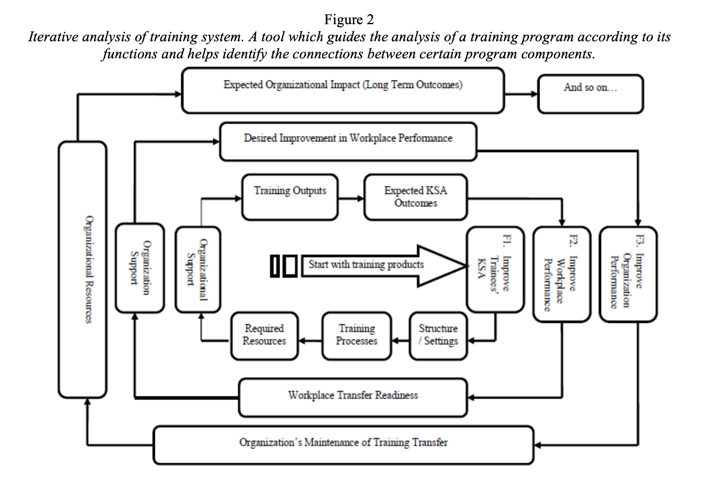
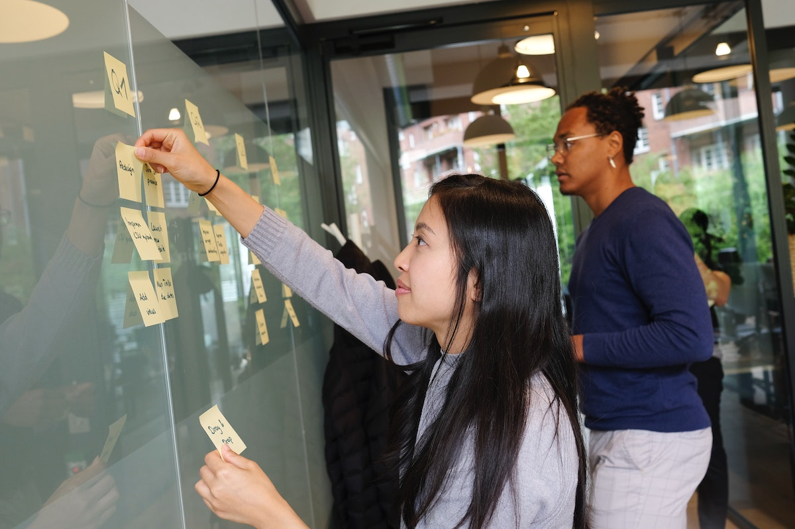

```{r setup, include=FALSE}
usethis::use_git_ignore(c("*.csv", "*.rds"))
options(htmltools.dir.version = FALSE)

library(knitr)
library(tidyverse)
library(xaringan)
library(fontawesome)
```

class: inverse, center, middle

**View the slides:** 

[bretsw.github.io/eme6357-module2](https://bretsw.github.io/eme6357-module2)

---

class: inverse, center, middle

# Evaluation Plan feedback

---

# Evaluation Plan, Part 1

```{r, out.width = "560px", echo = FALSE, fig.align = "center"}
include_graphics("img/group-project.jpg")
```

--

- Overall, fantastic work

--

- Work on developing your arguments (details, hyperlinks)

--

- Topic sentences: start with the point, then add evidence

---

# Evaluation Plan, Part 2

```{r, out.width = "560px", echo = FALSE, fig.align = "center"}
include_graphics("img/group-project.jpg")
```

--

### Systemic Analysis of a Training Program

--

- Create a systemic logic model for evaluating your training program

--

- Look at past examples

---

class: inverse, center, middle

# Flipgrid Discussions

---

# Flipgrid Discussions: Feedback

```{r, out.width = "720px", echo = FALSE, fig.align = "center"}
include_graphics("img/chat.jpg")
```

---

class: inverse, center, middle

# Research Tradeoffs

<div class="padlet-embed" style="border:1px solid rgba(0,0,0,0.1);border-radius:2px;box-sizing:border-box;overflow:hidden;position:relative;width:100%;background:#F4F4F4"><p style="padding:0;margin:0"><iframe src="https://fsu.padlet.org/embed/2be7mvchzccn5l4n" frameborder="0" allow="camera;microphone;geolocation" style="width:100%;height:480px;display:block;padding:0;margin:0"></iframe></p><div style="padding:8px;text-align:right;margin:0;"><a href="https://padlet.com?ref=embed" style="padding:0;margin:0;border:none;display:block;line-height:1;height:16px" target="_blank"></a></div></div>

---

# Self-Report Research

```{r, out.width = "480px", echo = FALSE, fig.align = "center"}
include_graphics("img/streetlamp.jpg")
```

- Humans are bad at estimating

--

  - (People are also bad at remembering)

--

- People change once they know you're observing

--

### `r fa("arrow-right", fill = "#782F40")` Observer Effect

---

# Unobtrusive Research

```{r, out.width = "450px", echo = FALSE, fig.align = "center"}

```

--

- Digital trace data from social media

--

- Reports and learning analytics from an LMS

--

### `r fa("arrow-right", fill = "#782F40")` Researcher Bias

---

# Research Tradeoffs

```{r, out.width = "540px", echo = FALSE, fig.align = "center"}

```

--

- Breadth vs. Depth:

--

  - Trends in global chocolate consumption during the pandemic
  
--

  - "Describe a place that this chocolate reminds of..."

---

class: inverse, center, middle

# Module 2 readings

---

class: inverse, center, middle

# Evaluating Training as a System 

---

# Darabi (2002)

```{r, out.width = "600px", echo = FALSE, fig.align = "center"}

```

--

- **Systems approach** to evaluation of training programs

--

  - systematic and procedural presentation of otherwise chaotic process

--

  - **whole picture** before and while considering individual pieces

---

# Darabi & Arrington (2017)

```{r, out.width = "600px", echo = FALSE, fig.align = "center"}

```

---

# Darabi & Arrington (2017)

```{r, out.width = "720px", echo = FALSE, fig.align = "center"}

```

---

# Darabi & Arrington (2017)

```{r, out.width = "560px", echo = FALSE, fig.align = "center"}
include_graphics("img/flowchart.jpg")
```

### Systemic Logic Model

- Inputs
- Processes
- Outputs
- Outcomes

---

# Darabi & Arrington (2017)

```{r, out.width = "560px", echo = FALSE, fig.align = "center"}
include_graphics("img/flowchart.jpg")
```

### Systemic Logic Model

- Inputs `r fa("arrow-right", fill = "#782F40")` **Reaction**
- Processes `r fa("arrow-right", fill = "#782F40")` **Learning**
- Outputs `r fa("arrow-right", fill = "#782F40")` **Behavior**
- Outcomes `r fa("arrow-right", fill = "#782F40")` **Results**

---

class: inverse, center, middle

# Evaluator Competencies

---

# IBSTPI (2006)

```{r, out.width = "480px", echo = FALSE, fig.align = "center"}

```

### Professional Foundations

- Communicate effectively in visual, oral, and written form
- Establish and maintain professional credibility
- Demonstrate effective interpersonal skills
- Observe ethical and legal standards
- Demonstrate awareness of the politics of evaluation

---

# IBSTPI (2006)

```{r, out.width = "480px", echo = FALSE, fig.align = "center"}

```

### Planning & Designing the Evaluation

- Develop an effective evaluation plan
- Develop a management plan for the evaluation
- Devise data collection strategies to support the evaluation questions and design
- Pilot test the data collection instruments and procedures

---

# IBSTPI (2006)

```{r, out.width = "480px", echo = FALSE, fig.align = "center"}

```

### Implementing the Evaluation Plan

- Collect data
- Analyze and interpret data
- Disseminate and follow-up the findings and recommendations

---

# IBSTPI (2006)

```{r, out.width = "480px", echo = FALSE, fig.align = "center"}

```

### Managing the Evaluation

- Monitor the management plan
- Work effectively with personnel and stakeholders

---

# Tourmen (2009)

```{r, out.width = "480px", echo = FALSE, fig.align = "center"}

```

### Making evaluation choices with experience

- Method-oriented vs. results-oriented
- Contextual/situational factors
- Actively transforming the situation

---

class: inverse, center, middle

# Questions?

```{r, out.width = "480px", echo = FALSE, fig.align = "center"}
include_graphics("img/question.jpg")
```

**What questions can I answer for you now?**

**How can I support you this week?**

<hr>

`r fa("envelope", fill = "white")` [bret.staudtwillet@fsu.edu](mailto:bret.staudtwillet@fsu.edu) | `r fa("twitter", fill = "white")` [@bretsw](https://twitter.com/bretsw) | `r fa("globe", fill = "white")` [bretsw.com](http://bretsw.com)